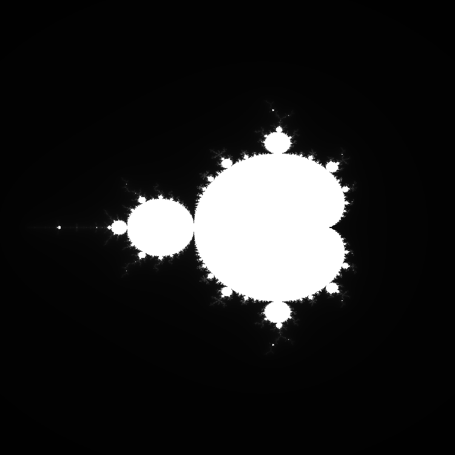

## Mandelbrot in Rust


Generate a mandelbrot set image with rust.

#### Example



#### Customizing

Can be customized by tweaking the following values (found at the beginning of `src/main.rs`):

```rs
// General information
const WIDTH: i32 = 750; // Width of your image
const HEIGHT: i32 = 750; // Height of your image
const FILE: &str = "mandelbrot.png"; // Name and Path of your file

const MAXITERATIONS: i32 = 255; // Maximum amount of iterations
const LIMIT: f32 = 5.0;

// Complex plane boundaries
const XMIN: f32 = -2.2 as f32;
const XMAX: f32 = 1.2 as f32;
const YMIN: f32 = -2.0 as f32;
const YMAX: f32 = 2.0 as f32;

// Coloring
const DYNAMIC: bool = true; // Dynamic uses the amount of iterations for coloring
const INVERTED: bool = false; // Swaps black and white

// Color definitions
const WHITE: [u8; 3] = [255, 255, 255];
const BLACK: [u8; 3] = [0, 0, 0];
```

[More information about the mandelbrot set](https://www.math.utah.edu/~alfeld/math/mandelbrot/mandelbrot.html) (University of Utah)